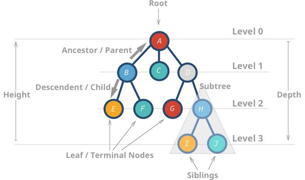
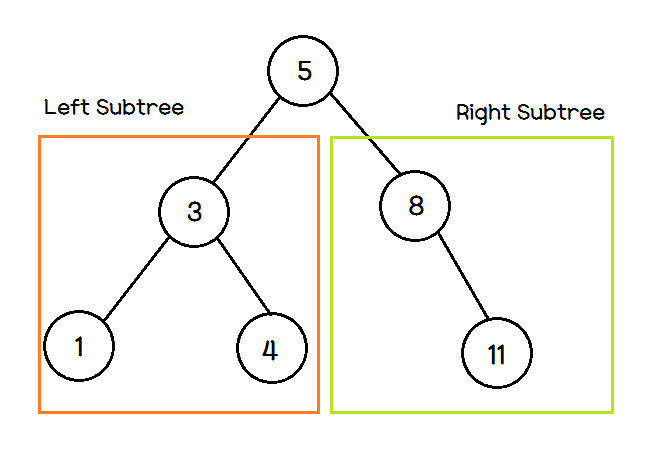

## 트리 자료 구조

데이터베이스는 내부적으로 대용량 데이터 처리에 적합한 트리 자료구조를 이용하여 항상 데이터가 정렬되어 있다.  
따라서 데이터 베이스에서의 탐색은 이진 탐색과는, 조금 다르지만, 이진 탐색과 유사한 방법을 이용해 탐색을 항상 빠르게 수행하도록 설계되어 있어서 데이터가 많아도 탐색하는 속도가 빠르다. 
### 트리 구조
--- 

   

1. 트리는 부모 노드와 자식 노드의 관계로 표현된다.   
2. 트리의 최상단 노드를 루트 노드라고 한다.  
3. 트리의 최하단 노드를 단말 노드라 한다.  
4. 트리의 일부를 때어내도 트리 구조이며 이를 서브트리라 한다.  
5. 트리는 파일 시스템과 가팅 계층저깅고 정렬된 데이터를 다루기에 적합하다.  

정리하자면, 큰 데이터를 처리하는 소프트웨어는 대부분 데이터를 트리 자료구조로 저장해서 이진 탐색과 같은 기법을 이용해 빠르게 탐색이 가능하다.   

## 이진 탐색 트리
트리 자료구조 중에 가장 간단한 형태가 이진 탐색 트리이다.   
이진 탐색 트리란 이진 탐색이 동작 할 수 있도록 고안된, 효율적인 탐색이 가능한 자료구조이다.
### 구조
---

   

이진 탐색 트리는 다음과 같은 특징을 가진다.
1. 부모노트보다 왼쪽 자식이 작다.
2. 부모 노드보다 오른쪽 자식 노드가 크다.   

즉 왼쪽 < 부모 < 오른쪽 자식 노드가 성립해야지 이진 탐색 트리이다. 이진 탐색 트리가 위에 처럼 구현되어 있다고 하고, 원소 4를 찾아보자.

step 1. 이진 탐색은 루트 노드부터 방문한다. 루트 노드는 5이고 우리가 찾는 원소는 4이니 왼쪽으로 가야된다.
step 2. 다음 부모 노드는 3이다. 4는 3보다 크니 오른쪽으로 이동한다.   
step 3. step 1, 2를 반복한다.