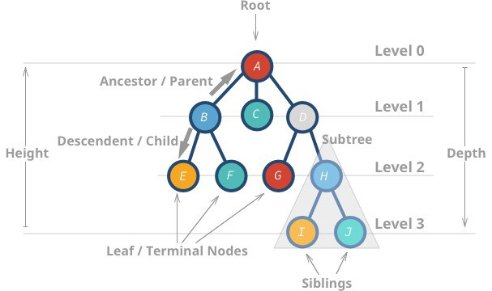
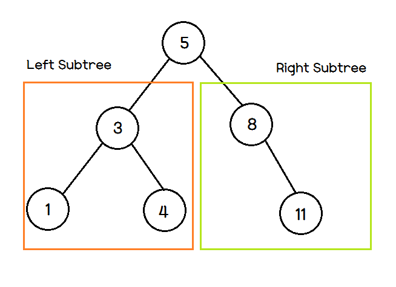

# chapter 7 : 이진탐색(binary search)

## 범위를 반 씩 좁혀가는 탐색
### 순자탐색
---
순차탐색이란 리스트 안에 있는 특정한 데이터를 찾기 위해 앞에서부터 데이터를 하나씩 차례대로 학인하는 방법이다. 보통 정렬되지 않은 데이터에서 데이터를 찾아야 할 떄 사용된다. 리스트 내에 데이터가 아무리 많아도 시간만 충분하다면 항상 원하는 원소를 찾을 수 있다는 장점이 있다.
```python
#7-1.py 순차 탐색 소스 코드
def sequential_search(n, target, array):
    for i in range(n):
        if array[i] == target:
            return i + 1 # 현재의 위치 반환(index + 1)

print('생성할 원소 개수를 입력한 다음 한 칸 띄고 찾을 문자열을 입력하세요.')
input_data = input().split()
n = int(input_data[0])
target = input_data[1]

print('앞서 적은 원소 개수만큼 문자열을 입력하세요. 구분은 띄어쓰기 한 칸으로 합니다.')
array = input().split()

print(sequential_search(n,target, array))
```
### 이진 탐섹 : 반으로 쪼개면서 탐색하기
---
이진 탐섹은 배열 내부의 데이터가 정렬되어 있어야만 사용할 수 있는 알고리즘이다. 데이터가 무작위일 떄는 사용 할 수 없지만, 이미 정렬 되어 있다면 매우 빠르게 데이터를 찾을 수 있다는 특징이 있다. 이진 탐색은 탐색 범위를 절반씩 좁혀가며 데이터를 탐섹하는 특징이 있다.   
이진 탐색은 위치를 나타내는 변수를 3개 사용하는데 탐색하고자 하는 범위의 시작점, 끝점 그리고 중간점이다. 찾으려는 데이터와 중간점 위치에 있는 데이터를 반복적으로 비교해서 원하는 데이터를 찾는 게 이진 탐색 과정이다.
```python
# 이진 탐색을 반복문으로 구현
def binary_search(array, target, start, end):
  while start <= end:
    mid = (start + end) // 2
    
    if array[mid] == target:
      return mid
    
    elif array[mid] > target:
      end = mid - 1
    
    else:
      start = end + 1
    
  return None
 
# 이진 탐색을 재귀로 구현
def binray_search(array, target, start, end):
  if start > end:
    return None
   
   mid = (start + end) // 2
   if array[mid] == target:
     return mid
   elif array[mid] > target:
     binary_search(array, target, start, mid - 1)
   else:
     binary_search(array, target, mid + 1, end)
```

## 트리 자료 구조

데이터베이스는 내부적으로 대용량 데이터 처리에 적합한 트리 자료구조를 이용하여 항상 데이터가 정렬되어 있다.  
따라서 데이터 베이스에서의 탐색은 이진 탐색과는, 조금 다르지만, 이진 탐색과 유사한 방법을 이용해 탐색을 항상 빠르게 수행하도록 설계되어 있어서 데이터가 많아도 탐색하는 속도가 빠르다. 
### 트리 구조
--- 
<p align="center"></p>   

1. 트리는 부모 노드와 자식 노드의 관계로 표현된다.   
2. 트리의 최상단 노드를 루트 노드라고 한다.  
3. 트리의 최하단 노드를 단말 노드라 한다.  
4. 트리의 일부를 때어내도 트리 구조이며 이를 서브트리라 한다.  
5. 트리는 파일 시스템과 같이 계층적이고 정렬된 데이터를 다루기에 적합하다.  

정리하자면, 큰 데이터를 처리하는 소프트웨어는 대부분 데이터를 트리 자료구조로 저장해서 이진 탐색과 같은 기법을 이용해 빠르게 탐색이 가능하다.   

## 이진 탐색 트리
트리 자료구조 중에 가장 간단한 형태가 이진 탐색 트리이다.   
이진 탐색 트리란 이진 탐색이 동작 할 수 있도록 고안된, 효율적인 탐색이 가능한 자료구조이다.
### 구조
---
<p align="center"></p>   

이진 탐색 트리는 다음과 같은 특징을 가진다.
1. 부모노트보다 왼쪽 자식이 작다.
2. 부모 노드보다 오른쪽 자식 노드가 크다.   

즉 왼쪽 < 부모 < 오른쪽 자식 노드가 성립해야지 이진 탐색 트리이다. 이진 탐색 트리가 위에 처럼 구현되어 있다고 하고, 원소 4를 찾아보자.

step 1. 이진 탐색은 루트 노드부터 방문한다. 루트 노드는 5이고 우리가 찾는 원소는 4이니 왼쪽으로 가야된다.
step 2. 다음 부모 노드는 3이다. 4는 3보다 크니 오른쪽으로 이동한다.   
step 3. step 1, 2를 반복한다.
