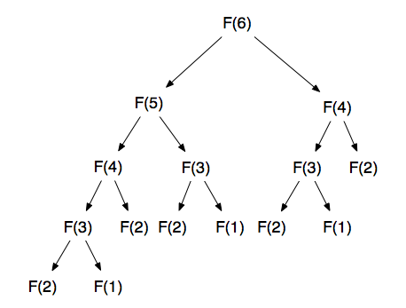

# 다이나믹 프로그래밍

## 중복되는 연산을 줄이자

컴퓨터를 활용해도 어려운 문제 중, 시간이 너무 많이 걸리거나, 메모리 공간이 매우 많이 필요한 경우가 있다.   
이럴 때 사용하는 것이 다이나믹 프로그래밍 방식이다.

### 1. 기본적인 아이디어
---
다이나믹 프로그래밍으로 연산량을 줄이는 대표적인 방법은 피보나치 수열의 예를 통해서 알 수 있다.   
피보나치 수열을 살펴보면   
1. n번 째 피보나치 수 = (n - 1)번째 피보나치 수 + (n - 2)번째 피보나치 수
2. 단, 1번째 피보나치 수 = 1, 2번째 피보나치 수 = 1   

프로그래밍에서는 이러한 수열을 배열이나 리스트로 표현이 가능하다.   
8-1.py 를 보면 피보나치 수열의 코드가 있으니 참고하자.   

그런데 피보나치 수열의 소스코드를 이렇게 작성하면 숫자가 커질 경우 연산량이 기하급수적으로 늘어난다.   
빅 오 표기법으로는 O(2n) 이고 N = 30 이면 10억 가량의 연산을 해야한다. 이유는 동일한 연산을 반복해서 하기 때문이다.

  
---
피보나치 수열의 점화식을 재귀 함수를 사용해 만들 수는 있지만, 단순히 매번 계산하도록 하면 문제를 효율적으로 해결할 수 없다.   
이러한 문제는 다이나믹 프로그래밍을 사용하면 효율적으로 해결 할 수 있다. 다만 항상 다이나나믹 프로그래밍을 사용할 수 는 없으며, 다음 조건을 만족할 때 사용 할 수 있다.   
1. 큰 문제를 작은 문제로 나눌 수 있다.
2. 작은 문제에서 구한 정답은 그것을 포함하는 큰 문제에서도 동일하다.   

다시 피보나치로 돌아와서, 이 문제를 메모이제이션 기법을 사용해서 해결해보자. 메모이 제이션은 다이나믹 프로그래밍을 구현하는 방법 중 한 종류로, 한 번 연구한 결과를 메모리 공간에 메모해두고 같은 식을 다시 호출하면 메모한 결과를 그대로 가져오는 기법을 의미한다. 값을 저장하는 방법이므로 캐싱 이라고도 한다.   

8-2.py를 보면 메모이 제이션을 통한 소스코드가 있다. 99 를 입력해도 금방 답이 나오는 것을 볼 수 있다.   

정리하자면 다이나믹 프로그래밍이란 큰 문제를 작게 나누고, 같은 문제라면 한 번 식만 풀어 문제를 효율적으로 해결하는 알고리즘 기법이다. 보통은 재귀함수 말고 반복문으로 구현된다.   

재귀함수를 이용하여 큰 문제를 작은 문제로 호출하여 푸는 방식을 탑 다운 방식이라고하고, 반복문을 통해 아래에서 부터 위로 올라가는 방식을 바텀 업 방식이다 한다. 위에서 말했듯이, 바텀 업 방식이 전형적인 해결 방법이다.   

8-4.py 에서 이런 바텀 업 방식을 다룬다.